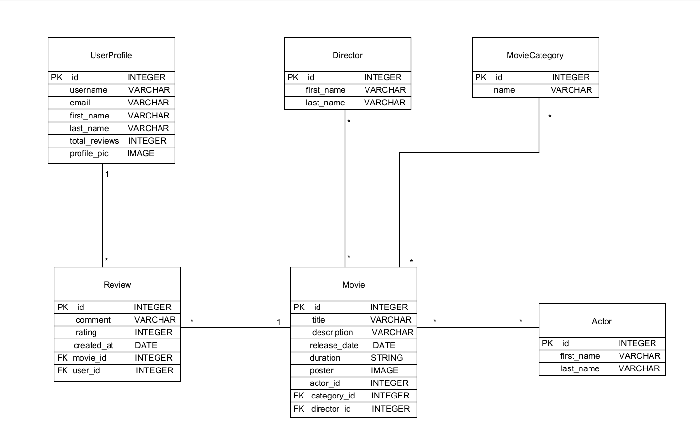

ΣΧΟΛΗ ΟΙΚΟΝΟΜΙΚΩΝ & ΠΟΛΙΤΙΚΩΝ ΕΠΙΣΤΗΜΩΝ 

ΤΜΗΜΑ ΔΙΟΙΚΗΣΗΣ ΕΠΙΧΕΙΡΗΣΕΩΝ ΚΑΙ ΟΡΓΑΝΙΣΜΩΝ 

 

Εργασία στο Μάθημα “Σχεδιασμός και Ανάπτυξη Διαδικτυακών Εφαρμογών”  

 

 
     Πρώτο παραδοτέο 

 

Ονοματεπώνυμα:  

Αγγελοπούλου Μαριλένα 

Λάμπρου Μαρία 

Εθνικό και Καποδιστριακό Πανεπιστήμιο Αθηνών 

Τμήμα: Διοίκηση Επιχειρήσεων και Οργανισμών 

Μάθημα: Σχεδιασμός και Ανάπτυξη Διαδικτυακών Εφαρμογών 

Επιβλέπων καθηγητής: Σωτηρόπουλος Θοδωρής 

Ακαδημαϊκό έτος: 2025-26 

Εξάμηνο: Εαρινό  

 
 

1. Σύντομη περιγραφή της εφαρμογής και των στόχων της 

 

Βασικό πρόβλημα/ανάγκη: Στον τεράστιο όγκο κινηματογραφικού περιεχομένου που προσφέρεται σήμερα, οι χρήστες δυσκολεύονται να επιλέξουν ποιοτικές ταινίες και σειρές που να ταιριάζουν στα γούστα και στα ενδιαφέροντά τους. Η εφαρμογή CineData έρχεται να καλύψει την ανάγκη για μια συγκεντρωτική πλατφόρμα όπου οι χρήστες όχι μόνο ενημερώνονται, αλλά συμμετέχουν ενεργά στη διαμόρφωση μιας αντικειμενικής βαθμολογίας μέσω της συλλογικής εμπειρίας.  

 

Κύριοι χρήστες: Οι κύριοι χρήστες της εν λόγω εφαρμογής είναι οι εξής: 

 

Φίλοι του κινηματογράφου και των σειρών (cinephiles): Που αναζητούν κριτικές και επιθυμούν να καταγράφουν τις δικές τους εντυπώσεις.  

 

Λειτουργίες: Η εφαρμογή προσφέρει πλήθος λειτουργιών για να 	εξυπηρετήσει τους χρήστες της όπως την εγγραφή χρήστη, την σύνδεση ή αυθεντικοποίησή του, την αποσύνδεσή του από την εφαρμογή, την διαχείριση του προφίλ του, την προβολή του ιστορικού κριτικών, την προβολή καταλόγου και λεπτομερειών περιεχομένου, αναζήτηση και φιλτράρισμα (προβολή περιεχομένου ανά κατηγορία) και την διαχείριση κριτικών και βαθμολογίας. 

 

 

2. Περιγραφή και τεκμηρίωση λειτουργιών 

 

Λειτουργία 1: Εγγραφή Νέου χρήστη (Sign-up) 

 

Περιγραφή: Η λειτουργία αυτή επιτρέπει στον χρήστη τη δημιουργία προσωπικού λογαριασμού στην εφαρμογή (προφίλ), ώστε ο ίδιος να έχει τη δυνατότητα υποβολής κριτικών και αποθήκευσης του ιστορικού του. 

Είσοδος χρήστη: Ο χρήστης επιλέγει το πεδίο “Εγγραφή εδώ” (sign-up) από την μπάρα πλοήγησης της αρχικής σελίδας. Στην συνέχεια, εισάγει την διεύθυνση του ηλεκτρονικού του ταχυδρομείου (email), ένα όνομα χρήστη (username) που αποτελεί την “ταυτότητά” του μέσα στην εφαρμογή (μοναδικότητα), έναν κωδικό πρόσβασης που ο ίδιος ορίζει και με τον οποίο του επιτρέπεται η είσοδος  στην εφαρμογή (password), καθώς επίσης και η επιβεβαίωση του κωδικού που έχει ορίσει. Τέλος, πρέπει να κλικάρει το checkbox “Αποδέχομαι τους Όρους Χρήσης και την Πολιτική Απορρήτου”. Σημειώνεται ότι στο κάτω μέρος της φόρμας υπάρχει η επιλογή “Έχεις ήδη λογαριασμό; Σύνδεση.” 

Έξοδος: Η σελίδα του προφίλ του χρήστη, η οποία επιβεβαιώνει την επιτυχή εγγραφή και εμφανίζει: 

Ενημερωμένη μπάρα πλοήγησης: Οι επιλογές “Εγγραφή” και “Σύνδεση” αντικαθίστανται από Όνομα Χρήστη, το εικονίδιο προφίλ και την επιλογή “Αποσύνδεση”. 

Μήνυμα επιβεβαίωσης: “Η εγγραφή σας ολοκληρώθηκε επιτυχώς”. Σε περίπτωση σφάλματος, εμφανίζονται μηνύματα ειδοποίησης πάνω από τα αντίστοιχα πεδία . 

Τα στοιχεία της νέας εγγραφής που δημιουργείται στη βάση δεδομένων: 

Όνομα χρήστη (username) 

Email 

Ημερομηνία εγγραφής 

Εικονίδιο προφίλ (προκαθορισμένη εικόνα χρήστη) 

Σύνολο κριτικών  

HTTP method/URL:  POST /signup/ 

Οθόνη (Mock-up): Αντιστοιχεί στο αρχείο [signup.html](movieapp/templates/signup.html)

Λειτουργία 2: Σύνδεση χρήστη (Login) 

 

Περιγραφή: Η λειτουργία αυτή επιτρέπει σε ήδη εγγεγραμμένους χρήστες να ταυτοποιηθούν από το σύστημα και να εισέλθουν στην εφαρμογή, αποκτώντας πρόσβαση στο προφίλ τους. 

Είσοδος χρήστη: Ο χρήστης επιλέγει την  εντολή “Σύνδεση¨ από την μπάρα πλοήγησης, εισάγει το όνομα χρήστη (username) και τον κωδικό πρόσβασης (password) στα αντίστοιχα πεδία της φόρμας σύνδεσης. Στο κάτω μέρος της φόρμας υπάρχει η επιλογή “Δεν έχεις λογαριασμό; Εγγραφή εδώ”.  

Έξοδος: Η αρχική σελίδα της εφαρμογής όπου εμφανίζονται: 

Ένα μήνυμα καλωσορίσματος στον χρήστη (π.χ. “Καλώς ήρθατε”).  

Ενημερωμένη μπάρα πλοήγησης με τις επιλογές το “Προφίλ μου” και “Αποσύνδεση”.  

Ο κατάλογος με τις προτεινόμενες ταινίες/σειρές όπου κάθε εγγραφή περιλαμβάνει: τίτλο, εξώφυλλο και βαθμολογία. 

HTTP method/URL: POST /login/ 

Οθόνη (Mock-up): Αντιστοιχεί στο αρχείο [login.html](movieapp/templates/login.html)

 
Λειτουργία 3: Αποσύνδεση χρήστη (Logοut) 

 

Περιγραφή: Η λειτουργία αυτή επιτρέπει στον συνδεδεμένο χρήστη να τερματίσει την τρέχουσα συνεδρία (session) του με ασφάλεια και διασφαλίζει την προστασία των προσωπικών δεδομένων του χρήστη. 

Είσοδος χρήστη: Ο χρήστης επιλέγει (κλικ) την εντολή “Αποσύνδεση” από το μενού πλοήγησης (navigation bar). Δεν απαιτείται εισαγωγή δεδομένων από τον χρήστη. 

Έξοδος: Η σελίδα επιβεβαίωσης αποσύνδεσης του χρήστη, η οποία του επιτρέπει την επανασύνδεση ή την επιστροφή του στην αρχική σελίδα. Συγκεκριμένα, περιλαμβάνει: 

Ένα μήνυμα επιτυχούς αποσύνδεσης χρήστη (π.χ. “Αποσυνδεθήκατε με επιτυχία!). 

Τις επιλογές “Σύνδεση ξανά” και “Επιστροφή στην αρχική”. 

HTTP method/URL: POST /logout/ 

Οθόνη (Mock-up): Αντιστοιχεί στο αρχείο [logout.html](movieapp/templates/logout.html)
  

 
Λειτουργία 4: Διαχείριση προφίλ χρήστη 

 

Περιγραφή: Η λειτουργία αυτή επιτρέπει στον συνδεδεμένο χρήστη να προβάλλει τα προσωπικά του στοιχεία (προφίλ), να τα τροποποιεί (π.χ. αλλαγή email) ή να διαγράφει οριστικά τον λογαριασμό του από την εφαρμογή.  

Είσοδος χρήστη:  Ο χρήστης επιλέγει την ενότητα “Το προφίλ μου”. Επίσης, στο κάτω μέρος της φόρμας του προφίλ υπάρχει η επιλογή “Πίσω στον κατάλογο”. 

Για επεξεργασία: Εισάγει τα νέα στοιχεία στα πεδία φόρμας και πατάει αποθήκευση. 

Για διαγραφή: Επιλέγει το κουμπί “Οριστική Διαγραφή” και επιβεβαιώνει την επιλογή του. 

Έξοδος: Στην περίπτωση της επεξεργασίας η σελίδα προφίλ του χρήστη, όπου κάθε εγγραφή περιλαμβάνει: 

Όνομα χρήστη (username) 

Email 

Ημερομηνία εγγραφής 

Εικονίδιο προφίλ 

Σύνολο κριτικών 

Μήνυμα επιβεβαίωσης: Εμφάνιση ειδοποίησης μετά την επιτυχή επεξεργασία. 

Στην περίπτωση διαγραφής λογαριασμού η αρχική σελίδα της εφαρμογής, η οποία περιλαμβάνει: 

Μήνυμα επιβεβαίωσης “Ο λογαριασμός σας διαγράφηκε επιτυχώς”.    

Ενημερωμένη μπάρα πλοήγησης: Επαναφορά των πεδίων “Σύνδεση” και “Εγγραφή” (εφόσον ο χρήστης δεν είναι πια μέλος). 

HTTP method/URL: Προβολή: GET /profile/ 

   Επεξεργασία: POST /profile/edit/ 

   Διαγραφή: POST /profile/delete/ 

Οθόνη (Mock-up): Αντιστοιχεί στο αρχείο [profile.html](movieapp/templates/profile.html)

5η Λειτουργία: Προβολή ιστορικού κριτικών: 

 

Περιγραφή: ο χρήστης μπορεί να βλέπει συγκεντρωμένες όλες τις κριτικές και τις βαθμολογίες που έχει υποβάλει στο παρελθόν. 

Είσοδος: ο χρήστης συνδέεται με το user id του (από το session) και επιλέγει την ενότητα ιστορικό κριτικών. 

Έξοδος: η λίστα με τους τίτλους των ταινιών/σειρών και αντίστοιχα το κείμενο της κριτικής, η ημερομηνία υποβολής και η βαθμολογία. 

URL: /profile/my-reviews 

HTTP Method URL: GET /reviews/reviews_history 

Οθόνη (Mock-up): Αντιστοιχεί στο αρχείο [reviews_history.html](movieapp/templates/reviews_history.html)

 

6η Λειτουργία: Προβολή καταλόγου  

 

Περιγραφή: ο χρήστης αφού έχει συνδεθεί με το username του και το password του βρίσκεται στην κεντρική οθόνη του CineData όπου είναι ο κατάλογος με τις ταινίες. Για κάθε ταινία/σειρά μπορεί να δει το εξώφυλλό της, τον τίτλο της, τη χρονιά που κυκλοφόρησε, τον μέσο όρο κριτικών σε αστέρια με μέγιστο τα 5 αστέρια, καθώς και το κουμπί “Λεπτομέρειες” όπου τον οδηγεί στην επόμενη λειτουργία, που είναι η προβολή λεπτομερειών και η υποσελίδα της κάθε ταινίας/σειράς με τις λεπτομέρειες (κριτικές, περιγραφή) 

Είσοδος: ο χρήστης εισάγει τον κωδικό του και βρίσκεται στον κατάλογο με τις ταινίες 

Έξοδος: ο τίτλος, το poster, η μέση βαθμολογία  

HTTP method URL: GET /catalog/  

Οθόνη (Mock-up): Αντιστοιχεί στο αρχείο [catalog.html](movieapp/templates/catalog.html)

 

7η Λειτουργία: Προβολή λεπτομερειών: 

 

Περιγραφή: ο χρήστης βρίσκεται στην υποσελίδα της κάθε ταινίας/σειράς με τις λεπτομέρειες (κριτικές, περιγραφή) 

Είσοδος: ο χρήστης κλικάρει το κουμπί ¨Λεπτομέρειες” που βρίσκεται πάνω σε κάθε ταινία/σειρά 

Έξοδος: ο τίτλος, η σύνοψη της ταινίας, σκηνοθεσία, πρωταγωνιστές, και το κουμπί “Δείτε τις Κριτικές” 

HTTP method URL: GET /catalog/details/ 

Οθόνη (Mock-up): Αντιστοιχεί στο αρχείο [deatils.html](movieapp/templates/details.html)

8η Λειτουργία: Αναζήτηση και Φιλτράρισμα:  

 

Περιγραφή: η δυνατότητα ο χρήστης να βρει το περιεχόμενο που θέλει με βάση το όνομα ή την κατηγορία/είδος (π.χ. κωμωδία), έτος ή βαθμολογία 

Είσοδος: ο χρήστης πατάει πάνω στην μπάρα αναζήτησης ή επιλέγει κάποιο φίλτρο από το μενού με τα φίλτρα της εφαρμογής. 

(string κειμένου, επιλογή είδους, εύρος ετών) 

Έξοδος: μια φιλτραρισμένη λίστα ταινιών/σειρών που ικανοποιούν τα κριτήρια 

HTTP method URL: GET /catalog/search/ 

Οθόνη (Mock-up): Αντιστοιχεί στο αρχείο [search.html](movieapp/templates/search.html)

9η Λειτουργία: Υποβολή κριτικής:  

 

Περιγραφή: ο χρήστης μπορεί να δημοσιεύει νέα κριτική (κείμενο ή/και αστέρια) 

Είσοδος: ο χρήστης κάνει κλικ στο κουμπί Κριτική ή Σχόλιο (Rating), γράφει το σχόλιό του ή βαθμολογεί με αστέρια 

Έξοδος: μετά την υποβολή, η εφαρμογή ανακατευθύνει τον χρήστη στο ιστορικό των κριτικών του. 

HTTP method URL: POST /reviews/ 

Οθόνη (Mock-up): Αντιστοιχεί στο αρχείο [reviews.html](movieapp/templates/reviews.html)

Σχήμα βάσης δεδομένων 

 

### Περιγραφή Πινάκων και Πεδίων

Η βάση δεδομένων αποτελείται από τους εξής πίνακες:

1. UserProfile (Προφίλ Χρήστη)
   - id (INTEGER, PK): Μοναδικός κωδικός χρήστη.
   - username / email (VARCHAR): Στοιχεία σύνδεσης.
   - first_name / last_name (VARCHAR): Ονοματεπώνυμο.
   - total_reviews (INTEGER): Συνολικός αριθμός κριτικών.
   - profile_pic (IMAGE): Φωτογραφία προφίλ.

2. Movie (Ταινία)
   - id (INTEGER, PK): Μοναδικός κωδικός ταινίας.
   - title / description (VARCHAR): Τίτλος και πλοκή.
   - release_date (DATE): Ημερομηνία κυκλοφορίας.
   - duration (STRING): Διάρκεια ταινίας.
   - poster (IMAGE): Αφίσα της ταινίας.
   - category_id (INTEGER, FK): Σύνδεση με τον πίνακα MovieCategory.
   - director_id (INTEGER, FK): Σύνδεση με τον πίνακα Director.

3. Review (Κριτική)
   - id (INTEGER, PK): Μοναδικός κωδικός κριτικής.
   - comment (VARCHAR): Το κείμενο της κριτικής.
   - rating (INTEGER): Βαθμολογία.
   - created_at (DATE): Ημερομηνία δημιουργίας.
   - movie_id (INTEGER, FK): Σύνδεση με την ταινία.
   - user_id (INTEGER, FK): Σύνδεση με το προφίλ του χρήστη.

4. Director (Σκηνοθέτης)
   - id (INTEGER, PK): Μοναδικός κωδικός σκηνοθέτη.
   - first_name / last_name (VARCHAR): Ονοματεπώνυμο.

5. MovieCategory (Κατηγορία Ταινίας)
   - id (INTEGER, PK): Μοναδικός κωδικός κατηγορίας.
   - name (VARCHAR): Όνομα κατηγορίας (π.χ. Δράση, Κωμωδία).

6. Actor (Ηθοποιός)
   - id (INTEGER, PK): Μοναδικός κωδικός ηθοποιού.
   - first_name / last_name (VARCHAR): Ονοματεπώνυμο.

### Συσχετίσεις Πινάκων (Relationships)

- Σχέση 1-προς-Πολλά (1:*): Ένας χρήστης (UserProfile) μπορεί να κάνει πολλές κριτικές (Review), και μια ταινία (Movie) μπορεί να έχει πολλές κριτικές.
- Σχέση 1-προς-Πολλά (1:*): Ένας σκηνοθέτης (Director) μπορεί να έχει σκηνοθετήσει πολλές ταινίες, και μια κατηγορία (MovieCategory) περιλαμβάνει πολλές ταινίες.
- Σχέση Πολλά-προς-Πολλά (*:*): Μια ταινία (Movie) μπορεί να έχει πολλούς ηθοποιούς (Actor) και ένας ηθοποιός μπορεί να παίζει σε πολλές ταινίες.

Λειτουργική οθόνη 

 

Αποφασίσαμε να υλοποιήσουμε την 9η λειτουργία: Υποβολή Κριτικής (reviews.html). 

 
